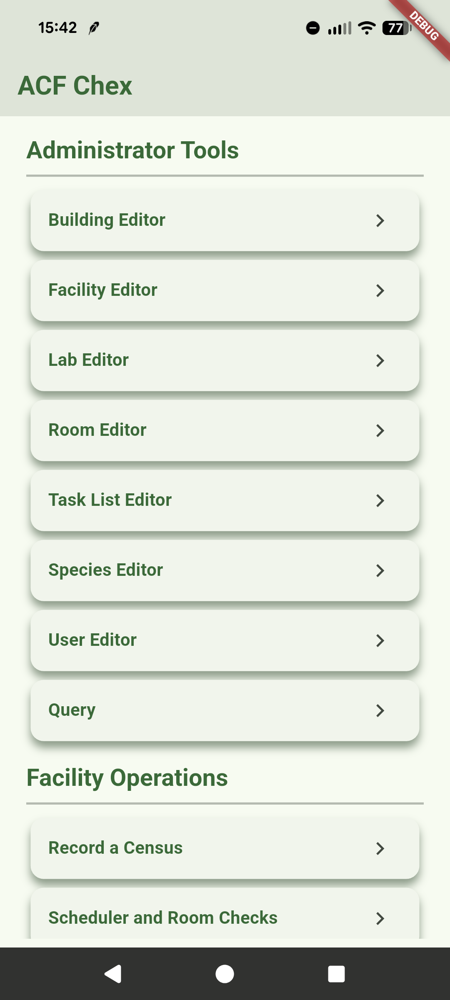
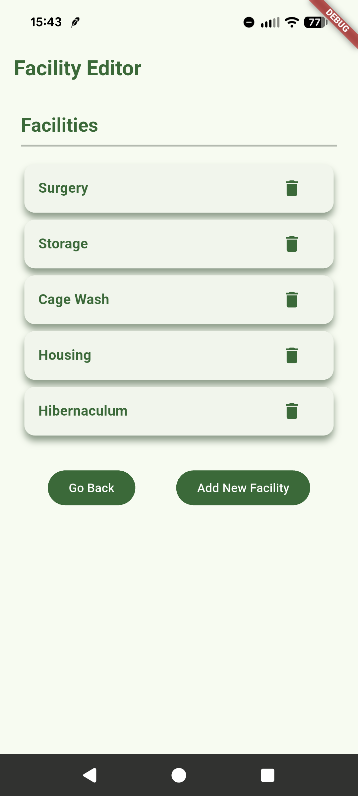
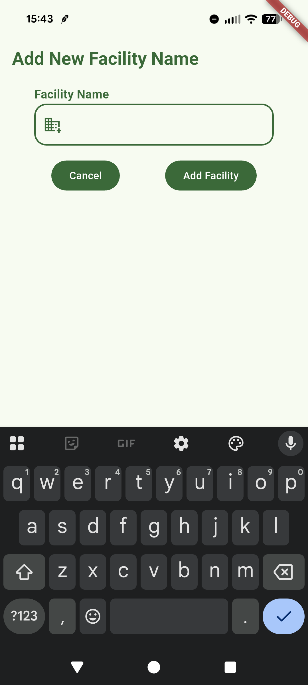
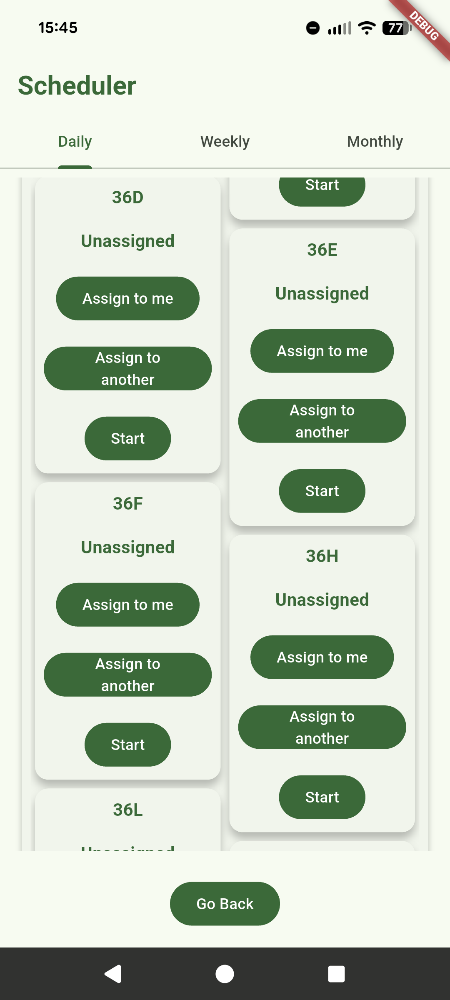
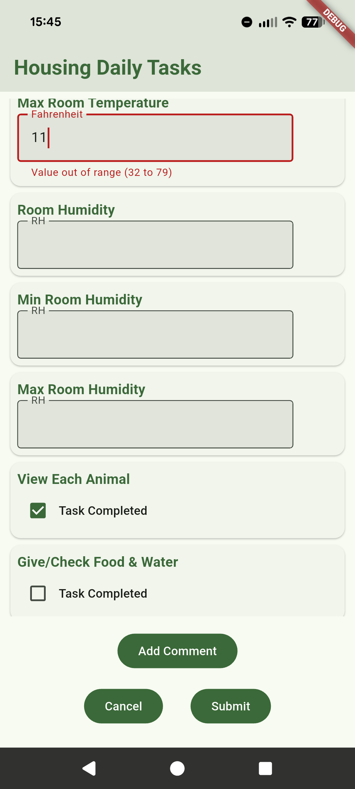

# Animal Room Task Manager

A Laboratory Information Management System (LIMS) built for managing daily operations in a university animal research facility.

The system replaces paper logs and fragmented tracking tools with a centralized workflow for room checks, task assignment, and record tracking.

## Features

- Role-based system (admin, supervisor, employee)
- Room check scheduling and assignment
- Daily / weekly / monthly checklist workflows
- Real-time task updates and status tracking
- Data logging for audits and reporting

## Tech Stack

- Flutter (cross-platform UI)
- Dart (application logic)
- Supabase / PostgreSQL (backend and database)
- MVVM architecture

### Project Screenshots
|        Administrator Menu         |            Facility Editor            | Add New Facility |
|:---------------------------------:|:-------------------------------------:| :---: |
|  |  |  |

|       Scheduler Interface       |          Task Data Entry          |
|:-------------------------------:|:---------------------------------:|
|  |  |